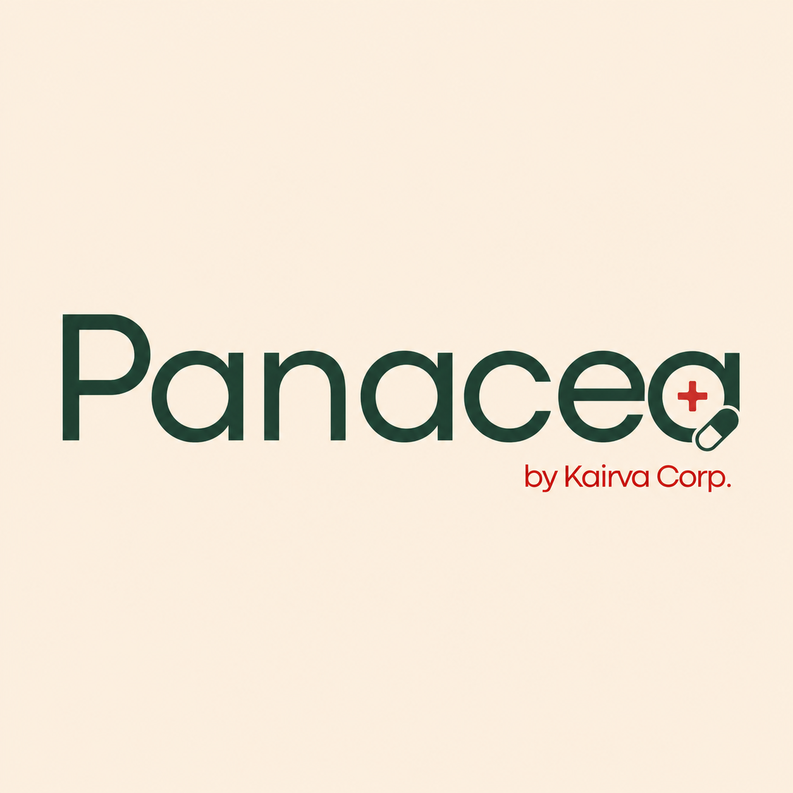
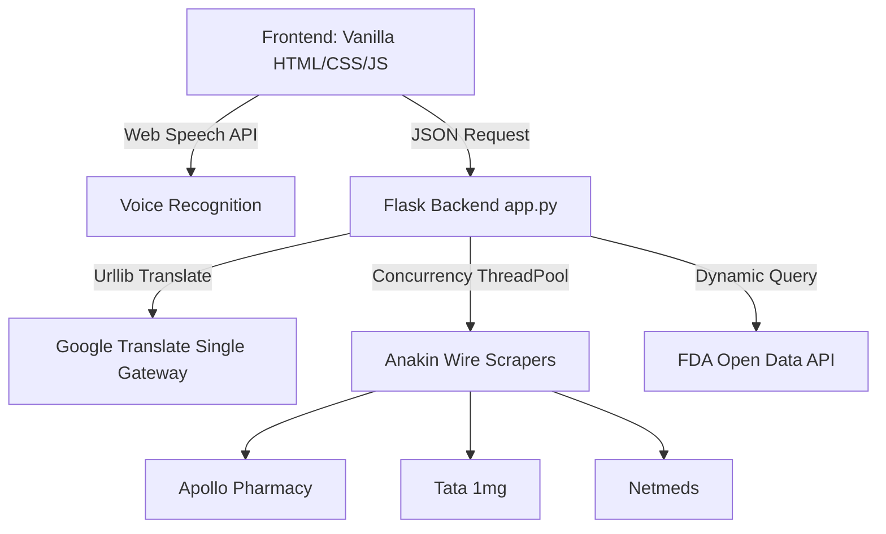

# 💊 Panacea — The Cure for Your Medicine Bill

<div align="center">
  
  <br/><br/>
  
  [](https://opensource.org/licenses/MIT)
  [](#)
  [](#)
  
  <h3>Compare live medicine prices across Apollo Pharmacy, Tata 1mg, and Netmeds in seconds. Built to maximize affordability and safety for chronic prescription users.</h3>
</div>

---

## 🛠️ Built by **Kairva Corps**

Panacea was developed in under 6 hours as a fast, pragmatic, and highly optimized health-tech solution. It transforms complex prescription listings into a clean, comparative dashboard for patients, elderly parents, and caregivers.

---

## ✨ Features

### 🎙️ 1. Zero-API Voice Input
* Genuinely seamless hands-free search using the browser's built-in **Web Speech API**.
* Zero external voice library imports, zero latency, and zero backend cost.
* **Locale-Aware:** Automatically switches speech recognition matching dynamically based on the selected language (English, Hindi, or Gujarati).

### 🌐 2. Complete Multilingual UI
* Support for 3 major Indian languages: **English**, **Hindi (हिन्दी)**, and **Gujarati (ગુજરાતી)**.
* **Local Translation Cache:** Swapping languages instantly re-translates all static subheads, button states, metadata, table headers, and monographs on screen without querying the database again.

### 🔄 3. Smart Script Translation
* User inputs in native script (like `मेटफॉर्मिन` or `ટેલ્મીસાર્ટન`) are auto-detected in the backend and translated to clean English equivalents (`metformin`, `Telmisartan`) to guarantee 100% correct pharmacy queries.
* Renders search results parenthetically, showing both scripts: `ટેલ્મીસાર્ટન (Telmisartan)`.

### 🧪 4. Live FDA Drug Profiles
* Scrapes generic compositions directly from search results using custom parsers (extracting from Apollo's `tags` and Netmeds' product `attributes`).
* Calls **FDA Open Data API** dynamically to pull indications, chemical mechanism descriptions, and warnings, with offline **WHO Model List of Essential Medicines** fallbacks to prevent any hallucinations.

### 🏛️ 5. Antique Prescription Letterhead Aesthetic
* Designed like a physical prescription card with a clean letterhead, perforation borders, color-coded warning stamps, and a masonry layout.

---

## ⚙️ Stack & Architecture



* **Backend**: Python + Flask (concurrency handling with `concurrent.futures`)
* **Frontend**: Vanilla HTML5 + Custom CSS Grid + Vanilla ES6 JS (no heavy framework overhead)
* **Data Layer**: Anakin Wire API (Scraper Nodes) + FDA Open Data Endpoint

---

## 🚀 Quick Start

### 1. Set up your API key
Create a `.env` file in the project root:
```env
ANAKIN_API_KEY=ask_your_anakin_key_here
```
> ⚠️ `.env` is pre-configured in `.gitignore` and will never be committed or leaked.

### 2. Install dependencies
```bash
pip install -r requirements.txt
```

### 3. Run the Launcher
```bash
python run.py
```
This starts the Flask backend on `http://localhost:5000` and automatically launches the app in your system's default browser.

---

## 🔌 API Documentation

### `POST /check-price`
Queries all active pharmacies concurrently.

**Request:**
```json
{
  "medicine_name": "मेटफॉर्मिन",
  "current_price": 300
}
```

**Response:**
```json
{
  "medicine_name": "Metformin",
  "original_name": "मेटफॉर्मिन",
  "salt_name": "Metformin Hydrochloride",
  "medicine_info": {
    "effects": "Metformin hydrochloride tablets are indicated as an adjunct to diet and exercise...",
    "side_effects": "The following adverse reactions are also discussed elsewhere: Lactic Acidosis...",
    "who_reference": "Sourced dynamically from FDA Open Data for Metformin"
  },
  "savings": {
    "baseline": 32.04,
    "cheapest": 26.27,
    "cheapest_name": "Metformin Hydrochloride 500mg",
    "cheapest_seller": "Netmeds",
    "headline_savings": 5.77,
    "savings_pct": 18
  },
  "results": [ ... ],
  "site_statuses": {
    "Apollo Pharmacy": "found 10 results",
    "Tata 1mg": "found 10 results",
    "Netmeds": "found 10 results"
  }
}
```

---

## 🔒 Security & Safety
* **API Protection**: No keys are stored in source code or sent client-side. The Flask backend functions as a proxy gateway.
* **Accuracy Assurance**: Generic/salt monographs match official FDA-regulated medical records. Hallucinated summaries are prohibited.

---

## ⚖️ Disclaimer
*Price and drug information shown is for reference and demonstration purposes only. Consult a registered medical practitioner or pharmacist before switching brands, generic variations, or dosages.*
